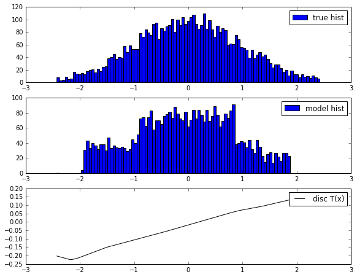
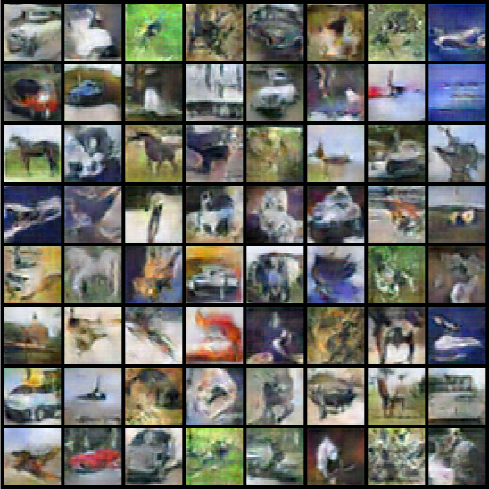

# MLSS 2018 - GAN Lecture Materials

* _Author_: Sebastian Nowozin (Sebastian.Nowozin@microsoft.com)
* _Date_: September 2018

## Slides

The total talk duration is 3 hours.
The PowerPoint version contains animations which unfortunately are not preserved in the PDF version.
However, the PDF version is much smaller and works across all platforms.

* PowerPoint version: [Introduction, (286MB), pptx](https://1drv.ms/p/s!AniEhJbTwIdrkrp7aTNiSw5kJNRu2Q?e=rdExvW)
* PDF export: [Introduction, 9MB](https://1drv.ms/b/s!AniEhJbTwIdrkrpt4Boqd6IDm3uqJQ?e=6wN1nO)

## f-GAN - Univariate Density Estimation

## f-GAN - DCGAN - CIFAR-10 - 32x32

